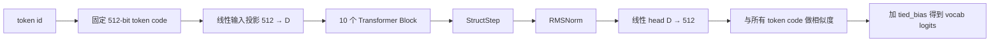
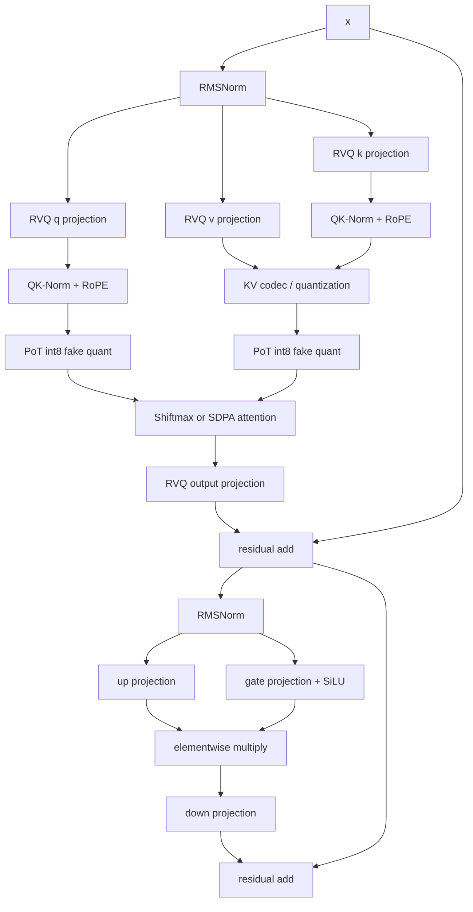

# 从 token 到 logits：先建立全局地图

## 1. 当前发布配置与 common.py 默认值不是一回事

common.py 给了可被环境变量覆盖的默认尺寸；真正的微调入口 finetune.py 在导入模型前设置发布配置：

| 符号 | 含义 | common.py 默认值 | 微调/发布入口值 |
|---|---:|---:|---:|
| D | hidden size | 1024 | 1536 |
| NL | block 数 | 20 | 10 |
| NH | query heads | 16 | 24 |
| NKV | key/value heads | 4 | 2 |
| HD | 每个 head 的维度 | 64 | 64 |
| FFNH | FFN 中间维度 | 3072 | 4224 |
| FPD | 固定 token code 的位/特征数 | 512 | 512 |

所以从不同入口导入模块，可能构造出不同形状。阅读具体实验时应先看入口设置了哪些 SHADOW_* 环境变量。

## 2. 整体数据流

传统语言模型通常有一个巨大的、可训练的词嵌入矩阵 $E\in\mathbb{R}^{V\times D}$。SHADOW 的做法不同：

- 每个 token 已有固定的 512-bit code，运行时映射成 $\{-1,+1\}^{512}$；
- 输入侧只训练 inp: 512 → D；
- 输出侧由 head: D → 512 预测一个 code，再与归一化词表 code 做点积；
- cent 和 cent_n 是 buffer，不是可训练参数。

对 hidden state $h$，输出大致是

$$
p = W_{head}h,\qquad
\operatorname{logits}_v = p^\top \frac{c_v}{\lVert c_v\rVert_2} + b_v.
$$

这里仍有一个长度为词表大小的 tied_bias，但没有 $V\times D$ 的浮点 embedding 参数。

## 3. 一个 Block 内发生什么

这仍是一个 pre-norm、GQA、SwiGLU 风格的 decoder block。特别之处主要是：

- 大部分线性层由 RVQ 包装，前向看到量化权重；
- Q/K/V 还会经过部署友好的激活量化；
- attention 的精确路径使用以 2 为底的 shiftmax；
- cached inference 可以把 KV 压成 1 bit 或 2 bit，并从冷 archive 召回。

## 4. 三种不同的“残差”

代码里很容易把它们混为一谈：

| 名称 | 出现位置 | 含义 |
|---|---|---|
| Transformer residual | x = x + ... | 给网络提供短路径，改善深层优化 |
| RVQ residual | r = r - q | 当前码本还没有逼近掉的权重误差 |
| reconstruction error | 原值减量化重建值 | 衡量压缩造成的数值误差 |

RVQ 的全名虽然也有 Residual，但它和 Transformer residual connection 没有结构关系。

## 5. 训练前向、cached inference、部署运行时

不要假设这三条路径完全相同：

| 路径 | 代码 | 目的 |
|---|---|---|
| 普通训练前向 | Block.forward | 可微、支持 batch 和完整序列 |
| Python cached inference | prefill_cached / decode_cached | 验证 KV 打包、冷 archive 与逐 token 解码 |
| 导出的 CPU runtime | .shdw + 预编译二进制 | 真正紧凑存储和高吞吐推理 |

例如当前 finetune.py 设置 SHADOW_KV_TWO_TIER=1，同时普通训练前向中的全局 KV_COLD_MASK 默认为 None；
因此该入口并不会在所有训练 token 上无条件套用 1-bit KV。而 cached inference 会明确执行 pack / unpack。
阅读“模型训练时见过何种误差”时必须沿实际入口判断，不能只看 KV_BITS=1 一个常量。
