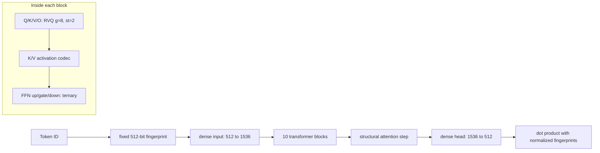
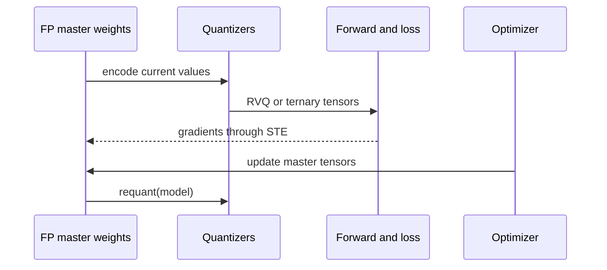

# 1. System map and quantization-aware training

## Model configuration

The release fine-tuning entry point sets $D=1536$, 10 blocks, 24 query heads, 2
KV heads, head width 64, and FFN width 4224. Environment variables override the
smaller defaults in `common.py`.

The model uses different precision policies by tensor role:

| Tensor | Release shape example | Representation |
|---|---:|---|
| Q projection | $(1536,1536)$ | two-stage RVQ |
| K or V projection | $(128,1536)$ | two-stage RVQ |
| FFN up/gate | $(4224,1536)$ | ternary |
| FFN down | $(1536,4224)$ | ternary |
| cached K or V | $(B,2,T,64)$ | 1-bit by default |
| input/head and small parameters | varies | dense FP32, later some FP16 |

## Straight-through estimation

Rounding and nearest-code selection are not usefully differentiable. The
custom `ste(x, q)` returns the quantized tensor $q$ in the forward pass but
passes the gradient to the floating-point source $x$ unchanged:

$$
\operatorname{STE}(x,q)=q,\qquad
\frac{\partial L}{\partial x}=\frac{\partial L}{\partial q}.
$$

### Scalar example

Suppose a master weight is $x=0.37$, but its quantizer produces $q=0.5$. If the
downstream loss locally has $\partial L/\partial q=0.8$:

| Pass | Value |
|---|---:|
| forward input seen by the layer | $0.5$ |
| gradient assigned to master $x$ | $0.8$ |
| SGD update at learning rate 0.1 | $0.37-0.1(0.8)=0.29$ |

The next forward quantizes the updated master again. Thus training optimizes
floating-point parameters while measuring loss through low-precision behavior.

## One optimizer step

`finetune.py` changes modules with `g == 32` to ternary forward computation and
makes their `enc()` a no-op. All other `RVQ` modules refresh `_q` after every
optimizer step through `requant(model)`. This override is essential: reading
only `Block.__init__` would incorrectly suggest that release FFNs use RVQ.

[Next: Residual vector quantization](02-rvq.md)

