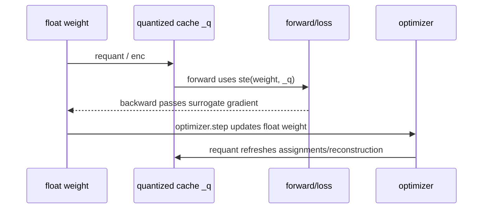

# 量化、QAT 与 STE：为什么取整后还能训练

## 1. 量化到底是什么

量化（quantization）把大量连续实数映射到少量离散表示。最普通的均匀量化可写成

$$
q(x)=s\cdot\operatorname{clip}\left(\operatorname{round}(x/s),q_{min},q_{max}\right),
$$

其中 $s$ 是 scale。存储时只保存整数 code 和必要的 scale；计算前可以反量化回近似浮点值。

三个词应分清：

- quantize：浮点值变成离散 code；
- dequantize / reconstruct：从 code 得到近似浮点值；
- fake quantization：训练中执行“量化再反量化”，张量表面仍是浮点，但数值只落在允许的量化格点上。

common.py 的 pot、kv2、KVCodec1.forward 和 RVQ.qw 都属于 fake-quantized 前向；
kv2_pack、KVCodec1.pack、rvq_pack 才生成真正紧凑的整数表示。

## 2. 为什么普通反向传播会失败

round(x) 在非整数边界附近是常数，几乎处处导数为 0；在跳变点又不可导。如果严格使用真实导数，
量化层前面的参数几乎收不到梯度：

$$
\frac{d\operatorname{round}(x)}{dx}=0\quad\text{a.e.}
$$

这就是 STE（Straight-Through Estimator，直通估计器）要解决的问题。它承认前向必须离散，
但反向传播时用人为指定的替代导数，例如恒等映射的导数 1：

$$
y_{forward}=q(x),\qquad
\frac{\partial y}{\partial x}\bigg|_{backward}\approx 1.
$$

STE 是一个优化技巧，不是 round 的数学真导数，也不保证梯度无偏。

## 3. 本项目的 _ExactSTE

核心代码等价于：

```python
class _ExactSTE(torch.autograd.Function):
    @staticmethod
    def forward(ctx, x, q):
        return q

    @staticmethod
    def backward(ctx, grad):
        return grad, None
```

因此 ste(x, q) 有两张“脸”：


| 阶段       | 行为                  |
| -------- | ------------------- |
| forward  | 返回 q，后续层真实看到量化/重建误差 |
| backward | 把上游梯度原样传给 x，不给 q 梯度 |


它也可以用常见的 detach 写法理解：

```python
y = x + (q - x).detach()
```

数值上 $y=q$，但 autograd 图上 $dy/dx=1$。

### 一个标量例子

设 $x=0.73$，量化后 $q=1$，loss 为 $L=y^2$。

- 前向：$y=1$，所以 $L=1$；
- 上游梯度：$dL/dy=2$；
- STE 反向：把 2 直接交给 $x$，即近似 $dL/dx=2$；
- 若严格经过 round，几乎处处会得到 0。


## 4. QAT 在 SHADOW 权重上的完整时序

RVQ 中存在两份不同角色的数据：

- weight：优化器更新的浮点主权重；
- _q：由当前主权重编码得到的量化重建缓存。




finetune.py 的关键顺序是：

```python
loss.backward()
optimizer.step()
requant(model)
```

梯度累积的多个 micro-batch 共用当前 _q；优化器更新浮点权重后才重编码一次。这既避免每个前向都做昂贵的
nearest-code 搜索，也保证下一步训练使用更新后的量化近似。

## 5. pot：scale 是 2 的幂，不是“所有值都是 2 的幂”

```python
m = x.abs().amax(-1, keepdim=True)
s = 2 ** ceil(log2(m / 127))
q = round(x / s).clamp(-127, 127) * s
```

这里每个最后一维向量共享一个 scale，并将 scale 向上取整为 2 的幂。这样最大绝对值能落入 signed int8
的 $[-127,127]$，且部署时乘除 scale 更容易变成二进制移位。

需要避免一个误解：重建值是“整数 $\times$ 二次幂 scale”，不要求每个重建值本身都是 2 的幂。

pot 返回 ste(x, q)，所以：

- 前向 attention 真实承受 int8 格点误差；
- 反向仍近似把它当作恒等映射；
- 当前函数本身不做 int8 存储，只做 fake quantization。


## 6. shiftmax 中也用了 STE

精确 attention 路径还量化了缩放参数与指数：

$$
\hat\alpha=\frac{\operatorname{round}(4096\alpha)}{4096},\qquad
e=\left\lfloor\hat\alpha(QK^\top)\right\rfloor,
$$

随后计算

$$
w_i=\frac{2^{\operatorname{clip}(e_i-\max(e),-15,0)}}
{\sum_j2^{\operatorname{clip}(e_j-\max(e),-15,0)}}.
$$

alpha 的取整和 floor 都通过 STE 传梯度。快速 SDPA 路径用
$\exp(z)=2^{z/\ln 2}$ 的等价关系，把 $\ln 2$ 合并到 query scale 中，但不包含精确路径的 floor 和
$-15$ 截断，因此是部署友好公式的一种平滑近似路径。

## 7. STE 的边界与调试方法

- STE 梯度忽略了“跨不过量化阈值时输出不变”的事实，因此训练可能抖动或产生梯度失配。
- 前向误差很大时，STE 不能神奇地恢复信息；码本、scale 和粒度仍必须设计合理。
- 判断量化是否真的生效，应同时看前向张量的唯一值/误差和导出后的整数 payload，不能只看 dtype。
- 检查 _q 是否过期：任何手工修改 weight、加载 checkpoint 或 optimizer.step() 后，都应按调用链确认
是否执行了 requant(model)。
