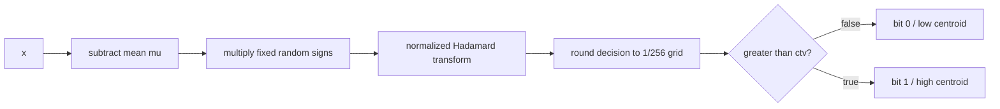

# 4. One-bit and two-bit KV codecs

KV quantization acts on dynamic attention activations, not weights. The input
shape is $(B,H_{KV},T,d_h)$; in the release configuration it is $(B,2,T,64)$.

## One-bit calibrated codec

Each layer has separate K and V `KVCodec1` instances. For each KV head and
coordinate, calibration learns a mean, threshold, low reconstruction centroid,
and high reconstruction centroid.

The random sign vector is fixed by a layer-specific seed. The normalized
Walsh-Hadamard transform spreads information across coordinates and is its own
inverse. Thresholds use medians, tending to balance the two bit values.

### Tiny calibration example

The real width is 64; use width 2 and one head for hand calculation. Let the
sign vector be $[+1,-1]$, and calibration tokens be

$$
x_1=[1,3],\qquad x_2=[3,1].
$$

Their mean is $\mu=[2,2]$. After centering and sign multiplication:

$$
z_1=[-1,-1],\qquad z_2=[1,1].
$$

For the normalized width-2 Hadamard transform
$H[a,b]=[(a+b)/\sqrt2,(a-b)/\sqrt2]$:

$$
Hz_1=[-\sqrt2,0],\qquad Hz_2=[\sqrt2,0].
$$

Ignoring the tiny $1/256$ grid effect, coordinate medians are approximately
`ctv = [0, 0]`. The learned levels are approximately
`low = [-1.414, 0]` and `high = [1.414, 0]`. Token $x_2$ encodes as `[1, 0]`
because the comparison is strictly greater than the threshold. Reconstruction
selects `[1.414, 0]`, applies Hadamard and signs, then adds the mean:

$$
[2,2]+([1,1]\odot[1,-1])=[3,1],
$$

recovering $x_2$ in this constructed example.

### Bit packing example

Eight decisions `[1,0,1,1,0,0,1,0]` use little-endian bit weights:

$$
1(1)+0(2)+1(4)+1(8)+0(16)+0(32)+1(64)+0(128)=77=\texttt{0x4D}.
$$

A width-64 vector therefore occupies 8 bytes. With two KV heads and both K and
V, one token consumes $2\times2\times8=32$ payload bytes per layer. Across 10
layers that is 320 bytes/token, before page and tensor overhead.

Calibration uses an exponential moving update with momentum 0.01 after its
first batch. `finetune.py` puts codecs in evaluation mode, preserving checkpoint
calibration during a small domain fine-tune.

## Two-bit Hadamard codec

The alternative rotates each vector and computes a power-of-two scale:

$$
s=2^{\lceil\log_2(\max|Hx|/1.5)\rceil}.
$$

Encoding rounds $Hx/s$, clamps to integer labels $[-2,-1,0,1]$, then adds 2 to
obtain codes $[0,1,2,3]$. Reconstruction uses the centered levels
$[-1.5,-0.5,0.5,1.5]s$ and applies Hadamard again.

### Four-value tensor example

Suppose an already-rotated vector is $y=Hx=[-2.7,-0.4,0.6,2.2]$. Then
$\max|y|/1.5=1.8$, so $s=2^{\lceil\log_2 1.8\rceil}=2$.

| $y_j$ | $y_j/s$ | rounded/clamped label | code | reconstructed rotated value |
|---:|---:|---:|---:|---:|
| -2.7 | -1.35 | -1 | 1 | -1.0 |
| -0.4 | -0.20 | 0 | 2 | 1.0 |
| 0.6 | 0.30 | 0 | 2 | 1.0 |
| 2.2 | 1.10 | 1 | 3 | 3.0 |

The four codes `[1,2,2,3]` pack as
$1+(2\ll2)+(2\ll4)+(3\ll6)=233=\texttt{0xE9}$. The apparent difference
between encoder integer labels and half-offset reconstruction levels is
intentional in `kv2_pack()`/`kv2_unpack()`. A scale tensor is retained for each
vector.

| Property | 1-bit KV | 2-bit KV |
|---|---|---|
| rotation | random signs + Hadamard | Hadamard |
| levels | calibrated low/high | four half-offset levels |
| width-64 payload | 8 bytes/vector | 16 bytes/vector |
| side information | persistent codec calibration | scale per vector |
| Hamming cold archive | yes | no |

[Next: Cache and retrieval](05-cache-and-retrieval.md)

