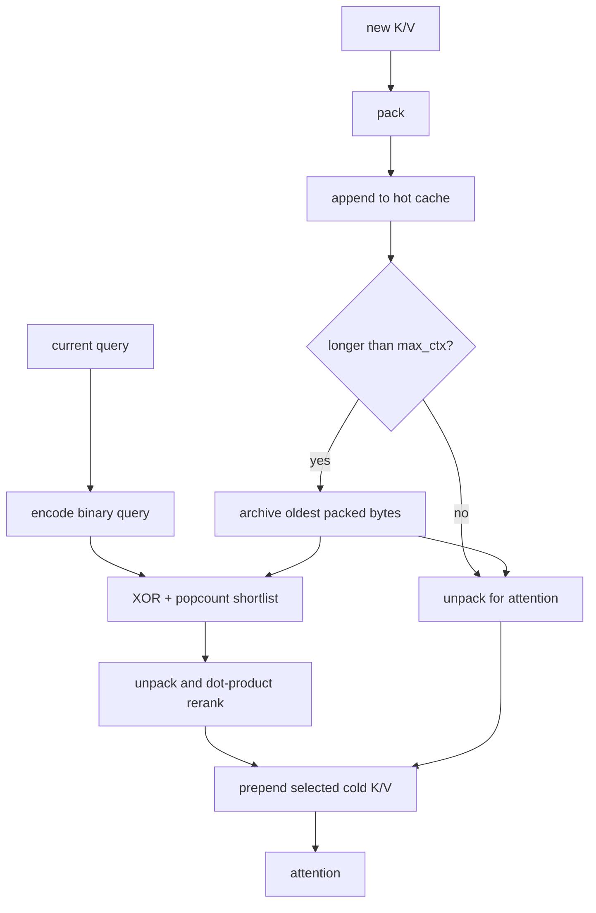

# 5. Hot cache, cold archive, and retrieval

Cached decoding stores compressed K/V bytes. `prefill_cached()` packs projected
K and V, unpacks them immediately for attention, and retains the packed form.
Consequently, the attention calculation includes codec error rather than using
an accidentally exact prefill.

## Hot and cold flow



The cold path exists only for one-bit KV. `PagedKVArchive` allocates fixed-size
uint8 pages for K and V and int64 pages for original positions. Append fills a
page before allocating the next, so old pages are not recopied whenever history
grows.

## Shape example

For batch 1, two KV heads, width 64, page size 256:

- packed K page shape: $(1,2,256,8)$ bytes;
- packed V page shape: $(1,2,256,8)$ bytes;
- combined allocated payload: $2\times1\times2\times256\times8=8192$ bytes;
- position page: $256\times8=2048$ bytes.

If only 100 slots are occupied, logical K+V payload is 3200 bytes, but allocated
storage remains 8192 payload bytes plus the position page. This is why logical
bit rate and resident memory are different measurements.

## Exact Hamming shortlist

Binary query and archive bytes are compared using XOR followed by popcount. For
one byte:

```text
query:    10110010
archive:  10010110
XOR:      00100100
popcount: 2
```

The distance across a width-64 vector is the sum over its eight XOR bytes. The
archive scans pages while retaining the smallest distances. It ranks by
`distance * (archive_length + 1) + index`, so an earlier archive index wins an
exact distance tie deterministically.

## Why rerank after Hamming search?

Query heads are grouped to match KV heads and averaged before binary encoding.
The archive first retains up to four times the requested final count by Hamming
distance. It then unpacks those K candidates and evaluates quantized dot
products against every query head in the group. The maximum head score ranks
each candidate, and only the final top-$k$ K/V pairs join attention.

Example with requested $k=2$:

| candidate | Hamming distance | shortlist? | rerank dot score | final? |
|---:|---:|---|---:|---|
| 17 | 5 | yes | 3.1 | yes |
| 42 | 6 | yes | 1.2 | no |
| 91 | 7 | yes | 2.8 | yes |
| 13 | 9 | yes | 0.4 | no |

Hamming distance cheaply finds plausible binary neighbors; reconstructed dot
products better approximate what attention actually needs.

## A separate memory system

`HammingHebbianMemory` is not the paged KV archive. It uses 512-bit token
fingerprint keys, stores entire evicted hidden-state chunks as power-of-two
scaled int8 values, reinforces sufficiently similar entries, and retrieves a
softmax-weighted mixture. It is optional model-level memory, whereas the paged
archive is per-layer attention K/V storage.

[Next: Export and storage](06-export-format.md)

