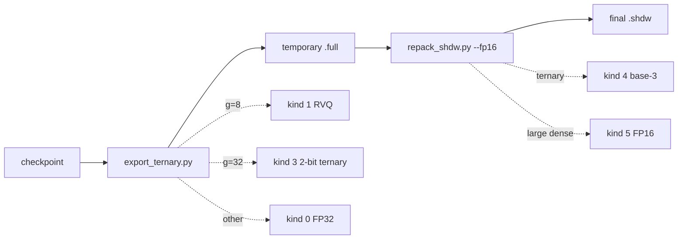

# 6. `.shdw` export and storage accounting

The deployment export is a two-pass conversion.



Every file starts with magic `SHDW`, version 1, and a record count. Each record
then stores name length, name, kind, and kind-specific payload.

| Kind | Payload | Lifetime |
|---:|---|---|
| 0 | dense FP32 tensor | initial and final for small dense tensors |
| 1 | RVQ dimensions, codebooks, packed indices, scales | final |
| 3 | four 2-bit ternary symbols/byte, row scales | temporary |
| 4 | five base-3 symbols/byte, row scales | final |
| 5 | dense FP16 tensor | final for dense arrays of at least 4096 elements |

## RVQ payload accounting

For $o$ output rows, $i$ inputs, group width $g$, and $st$ stages, let
$o_p=64\lceil o/64\rceil$. The payload is

$$
\underbrace{4(st\,g\,16)}_{\text{FP32 codebooks}}+
\underbrace{st(o_p/64)(i/g)32}_{\text{packed indices}}+
\underbrace{4o_p}_{\text{FP32 row scales}}\quad\text{bytes}.
$$

### Release Q projection example

For $(o,i,g,st)=(1536,1536,8,2)$, no row padding is needed:

| Component | Calculation | Bytes |
|---|---:|---:|
| codebooks | $4\times2\times8\times16$ | 1,024 |
| indices | $2\times24\times192\times32$ | 294,912 |
| row scales | $4\times1536$ | 6,144 |
| total | | 302,080 |

The dense FP32 matrix would use $1536^2\times4=9,437,184$ bytes. Converting the
exact payload to a per-weight rate gives
$302{,}080\times8/1536^2\approx1.024$ bits/weight. The extra 0.024 above the
nominal one bit is codebook and scale overhead.

## Ternary payload accounting

Final kind-4 packing is row-local. For an $(o,i)$ matrix, payload bytes are

$$
o\lceil i/5\rceil+4o.
$$

For FFN up $(4224,1536)$ this is
$4224\times308+4224\times4=1{,}317{,}888$ bytes. Dense FP32 would be
$25{,}952{,}256$ bytes. The row-local ceiling explains why dividing total
weights by five can be a few bytes too optimistic.

## What is deliberately separate

- The external `fp131072.npy` vocabulary fingerprint table is not embedded in
  `.shdw`; deployment size must include it separately.
- KV codec calibration buffers (`sign`, `mu`, `ctv`, `low`, `high`) are excluded
  from ordinary model records by `export_ternary.py`.
- `_q` is a transient reconstructed cache, not a parameter or exported tensor.
- `cb_init` and update counters are implementation state, not runtime weights.

## Verification commands

```bash
python3 finetune/modeling/export_rvq.py
python3 finetune/export_model.py CHECKPOINT.pt OUTPUT.shdw
```

The first compares packed/unpacked RVQ against `_q`. The second performs the
complete conversion and prints a ternary round-trip error. Both require the
documented NumPy and PyTorch dependencies; the full export also needs a real
checkpoint.

[Back to tutorial index](README.md)
