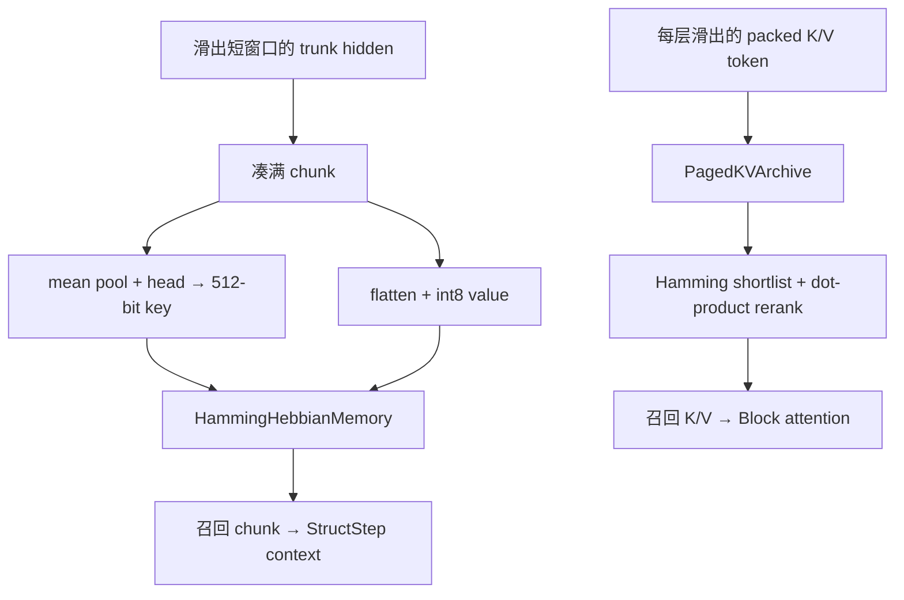

# Hamming–Hebbian 长期记忆与两种 archive

## 1. common.py 中其实有两套长期信息路径

它们都处理滑出短上下文的旧信息，但单位和检索方式不同：

| 路径 | 存什么 | key | value | 在哪里召回 |
|---|---|---|---|---|
| 每层 cold KV archive | 每层旧 token 的 1-bit K/V | 该层 packed K | 该层 packed V | 每个 Block 的 attention |
| HammingHebbianMemory | trunk hidden 的完整 chunk | 512-bit 输出特征符号 | int8 压缩 hidden chunk | 最终 StructStep context |

此外，README 中 shadow_runtime/ 的“offline archive question answering”还是更高层的词法检索/抽取流水线。
它与 modeling 中的 PagedKVArchive 不应只因都叫 archive 就视为同一个对象。

这两条 modeling 内的长期路径目前只在 Python cached inference 显式启用 `use_memory=True` 时进入；
`Shadow250M` 默认关闭它们。不能仅凭这些类存在，就推断预编译部署 runtime 已启用相同的长期记忆语义。

## 2. 512-bit Hamming key

bitpack512 只保留 512 个特征的符号：

$$
b_i=[x_i\ge0].
$$

每 8 个 bit 打包为一个 byte，因此每个 key 是 64 bytes。两个 key 的 Hamming distance 用

$$
d_H(a,b)=\operatorname{popcount}(a\oplus b)
$$

计算。相似度被定义为

$$
\operatorname{sim}(a,b)=1-\frac{d_H(a,b)}{512}.
$$

它衡量 512 个符号位中相同的比例，不是 cosine similarity 的精确值。

## 3. value 的 int8 压缩

mem8_pack 对最后一维共用一个 2 的幂 scale：

$$
s=2^{\lceil\log_2(\max|x|/127)\rceil},\qquad
c=\operatorname{clip}(\operatorname{round}(x/s),-127,127).
$$

存储 int8 code 与 scale，读取时计算 $\hat x=cs$。这与 pot 的数值规则相似，但用途不同：pot 是 attention
前向中的 fake quantization；mem8_pack 真的返回 int8 payload。

## 4. 写入：allocate、reinforce、replace

一个 hidden chunk 先在 token 维求平均，经最终 norm + head 映射为 512 维 key feature；整个 chunk flatten 后作为 value。

对新 key：

1. 找现有 slot 中 Hamming distance 最小者；
2. 若 similarity ≥ match_threshold（默认 0.90），不分配新 slot，而是强化原 slot；
3. 否则容量未满就 allocate；
4. 容量已满则优先替换 strength 最低、再按 age 最旧的 slot。

“Hebbian”体现在相似模式重复出现时 value 朝新观察移动、strength 增加：

$$
\eta'=\eta\cdot\operatorname{sim},\qquad
v\leftarrow v+\eta'(v_{new}-v).
$$

这是局部在线更新规则，不通过 loss.backward，也没有 optimizer。

## 5. 读取：top-k 加权

retrieve 取 Hamming distance 最小的 k 个 slot（默认 4），再以较尖锐的 softmax 混合 value：

$$
w_i=\operatorname{softmax}(32\cdot\operatorname{sim}_i),\qquad
v_{recall}=\sum_iw_i v_i.
$$

metadata 中只记录最佳 slot 的 similarity/distance，但输出 value 是 top-k 混合，并非只来自最佳 slot。

memory_append_recall 还有第二道 recall_threshold（默认 0.60）。达到阈值时将 flatten value reshape 回
$(chunk\_size,D)$，乘最佳 similarity 作为 gate，再拼到 StructStep 的 context 尾部。

## 6. 与 cold KV archive 的差别

第一条是跨层后的语义 chunk memory；第二条保留每层 attention 所需的 K/V token。它们不能互相替代：
hidden chunk 不能直接当某层 K/V，某层 K/V 也不能直接当最终 StructStep 的 hidden context。

## 7. no_grad 的含义

memory_absorb_evicted、memory_append_recall、write 等都在 no_grad 下。这套 memory 是推理时的外部状态，
不是端到端可微 memory。召回内容会影响后续输出，但训练不会通过召回操作学习 key 分配、slot 替换或 Hebbian rate。

## 8. 容易踩的坑

- Hamming key 只保留符号，幅值信息进入不了距离；幅值主要留在 value 中。
- similarity 的 0.90 与 recall_threshold 的 0.60 作用不同：前者决定写入时是否强化，后者决定读取时是否拼接。
- 一个 slot 的 strength 越高越不容易被替换；age 只在 strength 相同时作为次级条件。
- memory state 按 batch 分开维护，batch 中不同样本不会共享 slot。
- PagedKVArchive 保存 original position index；HammingHebbianMemory 只保存 slot age，不保存原 token 的逐位置索引。
